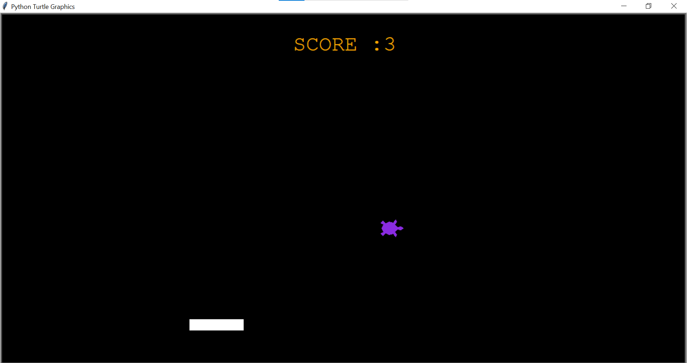

# Falling Shapes Game 🎮

A fun and engaging arcade-style game built with Python's Turtle graphics library where players control a paddle to catch falling shapes.




---

## Table of Contents
- [About the Game](#about-the-game)
- [Features](#features)
- [Installation](#installation)
- [How to Play](#how-to-play)
- [Controls](#controls)
- [Game Structure](#game-structure)
- [Contributing](#contributing)
- [License](#license)
- [Acknowledgements](#acknowledgements)

---

## About the Game
**Falling Shapes** is a classic arcade-style game where players control a paddle at the bottom of the screen to catch various falling shapes. Each shape caught increases your score, but missing too many ends the game!  

This project was developed using Python's built-in Turtle graphics library, making it accessible without additional dependencies.

---

## Features
- 🎯 Multiple shape types with different point values  
- ⚡ Increasing difficulty as you progress  
- 🎨 Colorful and visually appealing graphics  
- 📊 Score tracking and high score system   
- 🕹️ Simple and intuitive controls  

---

## Installation

### Prerequisites
- Python 3.6 or higher  
- Turtle module (comes pre-installed with Python)

### Steps
1. Clone the repository:
```bash
git clone https://github.com/loubnatech7/falling-shapes-game.git
Navigate to the game directory:

bash
Copier
Modifier
cd falling-shapes-game
Run the game:

bash
Copier
Modifier
python falling_shapes.py
How to Play
Launch the game using the instructions above.

Use the left and right arrow keys to move your paddle.

Catch the falling shapes with your paddle.

Each shape caught adds to your score based on its type.

Avoid missing shapes — too many misses will end the game.

Try to beat your high score with each playthrough!

Controls
Key	Action
←	Move paddle left
→	Move paddle right

Game Structure
bash
Copier
Modifier
falling-shapes-game/
│
├── main.py              # Main game file
├── README.md            # This file
└── assets/              # Game assets
    ├        
    └── images/          # Image files (if any)
Code Overview
Game Initialization: Sets up the game window, players, and initial state

Shape Generation: Creates falling shapes with random properties

Game Loop: Handles game logic, rendering, and user input

Collision Detection: Determines when shapes are caught or missed

Score System: Tracks and displays player score and high score

Contributing
We welcome contributions to the Falling Shapes Game! Please read our CONTRIBUTING.md for guidelines on submitting pull requests, reporting issues, or suggesting new features.

Ways to Contribute
Add new shape types with special abilities

Implement power-ups or bonus items

Create additional game levels or modes

Improve graphics or animations

Optimize game performance

Enhance sound effects or add background music

Translate the game to other languages

License
This project is licensed under the MIT License — see the LICENSE file for details.

Acknowledgements
Built with Python's Turtle graphics library

Inspired by classic arcade games

Sound effects from Freesound.org

Thanks to all our contributors and players!

<div align="center"> Enjoy playing! 🎮
If you like this game, please give it a ⭐ on GitHub!

</div> `
